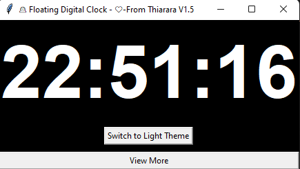
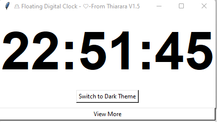
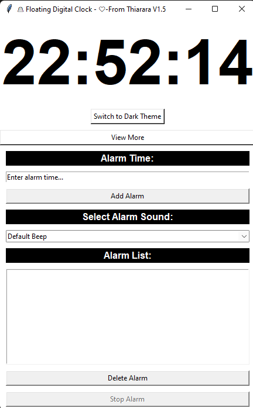
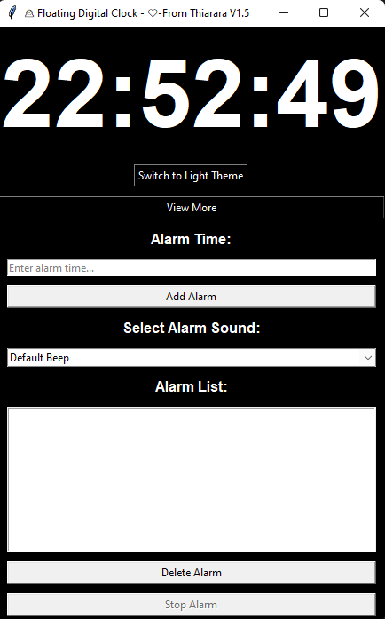


# Floating Digital Clock - Version 1.5

## Overview

The Floating Digital Clock, version 1.5, is a Python Tkinter application that provides a sleek floating digital clock with alarm features. It is crafted with passion by Thiarara to bring you a seamless timekeeping experience.

## Features

- Real-time digital clock display
- Alarm functionality with sound options
- Dark and light theme support
- Easy-to-use interface
- Live Vusoned integration
- Additional customization options for an enhanced user experience


## Installation

1. Clone or download this repository:

   ```bash
   git clone https://github.com/Thiararapeter/Python-Floating-Digital-clock.git
   ```

2. Navigate to the project directory:

   ```bash
   cd floating-digital-clock
   ```

3. Install dependencies:

   ```bash
   pip install -r requirements.txt
   ```

4. Run the application:

   ```bash
   python your_script.py
   ```

## Folder Installation

To create a standalone executable {.exe} file and a folder containing all necessary files, you can use PyInstaller. Follow the steps below:

1. Install PyInstaller:

   ```bash
   pip install pyinstaller
   ```

2. Create the standalone executable and folder:

   ```bash
   pyinstaller --onefile --distpath=./my_folder --clean your_script.py
   ```

   Replace `your_script.py` with the actual filename of your Python script.

3. Locate the generated files:

   After running the command, find a folder named `my_folder` in your script's directory. Inside that folder, you'll find the standalone executable and any necessary files.


## Screenshots


*Main UI - Floating Digital Clock*


*View  UI in light theme*


*Settings and Alarm Configuration in light theme*


*Customization and Theme Selection*

## Contribution

Contributions are welcome! If you have ideas for new features or find any issues, please open an [issue](https://github.com/Thiararapeter/Python-Floating-Digital-clock/issues) or submit a [pull request](https://github.com/Thiararapeter/Python-Floating-Digital-clock/pulls).

## License

This software is released under the GNU General Public License, version 2 (GPL-2.0). See the [LICENSE](LICENSE) file for more details.

## Versioning

- Version 1.5: Initial release with a variety of features.
- Version 2.0 and above: Future releases will introduce new features and improvements.


## Contact

For any questions or feedback, feel free to contact Thiarara at [contact@thiarara.co.ke](mailto:contact@thiarara.co.ke).

Enjoy using the Floating Digital Clock! ❤️
```

